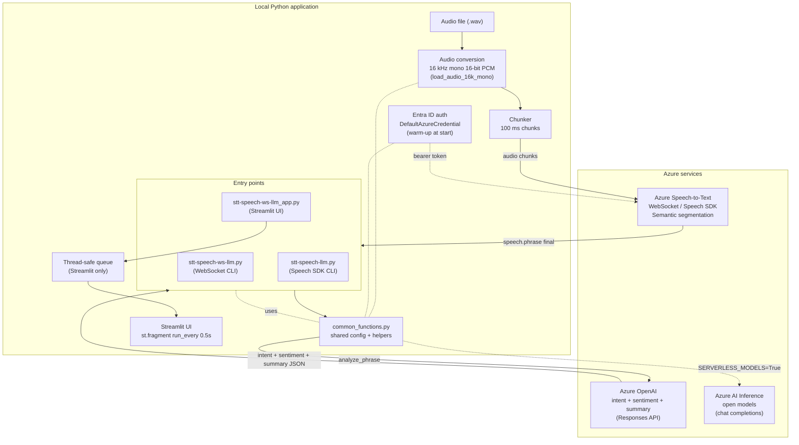
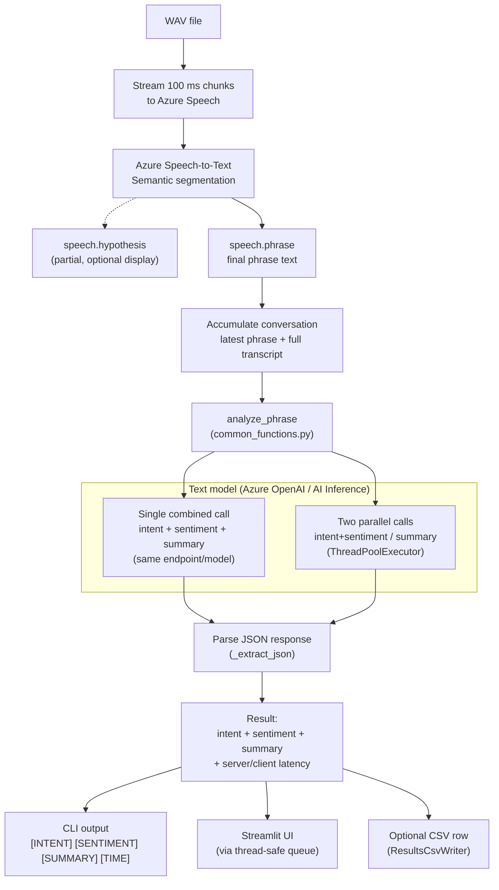
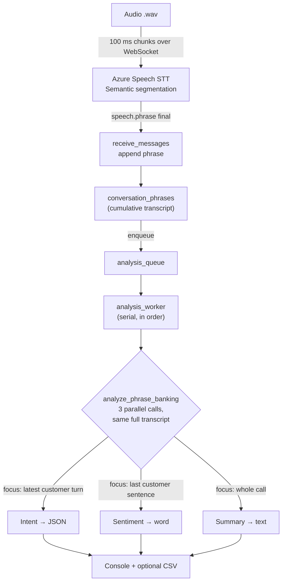

# Real-Time Speech-to-Text + LLM (Azure Speech + Azure OpenAI)

Real-time transcription of audio (`.wav` files) streamed to **Azure Speech-to-Text**,
where every final phrase is analyzed by **Azure OpenAI** to detect the caller's
**intent**, classify the per-phrase **sentiment** and maintain a running
**summary** of the conversation.

Use case: **customer support phone calls**.

```
audio .wav → convert to 16 kHz mono 16-bit PCM → WebSocket to Azure Speech
→ final phrase (speech.phrase) → Azure OpenAI (intent + sentiment + summary) → output
```

---

## Features

- **Real-time WebSocket streaming** to the Azure Speech STT service with
  **Semantic segmentation** (`phraseDetection.CONVERSATION.segmentation.mode = "Semantic"`).
- **On-the-fly audio conversion** of any WAV (stereo / arbitrary sample rate /
  8-, 16- or 32-bit) to the required **16 kHz mono 16-bit PCM**. Non-WAV formats
  (`.mp3`, `.m4a`, ...) are decoded automatically via **ffmpeg** (must be on `PATH`).
- **Per-phrase LLM analysis**: intent classification (closed list), per-phrase
  sentiment (`positive` / `neutral` / `negative`, evaluated on the latest phrase
  only) and a cumulative conversation summary.
- **Editable intent taxonomy**: intents and their descriptions live in `intents.csv`,
  loaded at startup and injected into the prompt to improve classification — no code
  changes needed to add, remove or refine intents.
- **Single combined call** when intent and summary share the same endpoint/model,
  or **two parallel calls** (`ThreadPoolExecutor`) when they differ. Intent and
  sentiment are both per-phrase and always run on the **intent** model/endpoint;
  the **summary** model/endpoint is used only for the summary.
- **Entra ID authentication** (`DefaultAzureCredential`) by default; API keys only
  in serverless mode.
- **Start-up warm-up** of the Speech token and Azure OpenAI HTTPS connection(s) so
  the first real call is fast.
- **Two model backends**: Azure OpenAI (Responses API) or Azure AI Inference
  (chat completions) for open models such as Qwen / GPT-OSS.
- **Latency measurement** via server-side processing time (`openai-processing-ms` /
  `x-envoy-upstream-service-time`) with a client wall-clock fallback.
- **Optional CSV output** of the per-segment results (columns: `segment`,
  `transcription`, `intent`, `sentiment`, `summary`, `time`) — a `--csv` flag on the
  CLIs and a sidebar field in the Streamlit app.
- **Three entry points**: a CLI WebSocket client, a Speech SDK CLI client, and a
  Streamlit web UI.

---

## Architecture



---

## Processing pipeline

End-to-end flow of a `.wav` file: audio is streamed to Azure Speech and every final
phrase is analyzed by the text model (intent + sentiment + summary). Implemented
across `common_functions.py` and the entry-point scripts.



`analyze_phrase` runs a **single combined call** when intent and summary share the
same endpoint/model, or **two parallel calls** when they differ. Intent and
sentiment are always evaluated on the **latest phrase only**, while the summary is
maintained cumulatively over the full transcript. Latency is reported from the
server processing headers with a client wall-clock fallback.

---

## Key files

| File | Description |
| --- | --- |
| `common_functions.py` | **Central module every script depends on.** Configuration constants, audio conversion, Azure OpenAI client creation / warm-up / phrase analysis, Speech authentication and WebSocket protocol message builders. |
| `stt-speech-ws-llm.py` | CLI client that streams audio over **WebSocket** and runs LLM analysis per phrase. |
| `stt-speech-ws-llm-secs.py` | WebSocket CLI variant with **exact fixed-time segments**: optionally slices the audio client-side into precise N-second windows (`--interval`), one recognition turn per segment over a single connection. Without the flag it behaves like `stt-speech-ws-llm.py`. |
| `stt-speech-ws-llm-banking.py` | **Banking call-center variant**: uses the dedicated intent / sentiment / summary prompts from `banking_prompts/` and always runs the three analyses as parallel calls per phrase. |
| `stt-speech-llm.py` | CLI client using the **Azure Speech SDK** (`PushAudioInputStream`) with Entra ID auth and Semantic segmentation. |
| `stt-speech-ws-llm_app.py` | **Streamlit** web UI. The pipeline runs in a dedicated background thread; the UI only reads results from a thread-safe queue. |
| `intents.csv` | Editable intent taxonomy (`intent,description` columns) loaded at startup and injected into the LLM prompt. |
| `banking_prompts/` | Prompt payloads for the banking variant: `intent.json`, `sentiment.json`, `summary.json` (baseline), plus `intent-gpt5.json`, `sentiment-gpt5.json`, `summary-gpt5.json` (the same tasks rewritten for `gpt-5.x` best practices). |
| `customer-support-sample.wav` | Default sample audio file. |

---

## Python scripts

| Script | Transport | What it does |
| --- | --- | --- |
| `common_functions.py` | — | **Shared library imported by every script.** Holds all configuration constants, audio conversion to 16 kHz mono 16-bit PCM, Azure OpenAI client creation / warm-up / `analyze_phrase`, Speech Entra ID authentication, WebSocket protocol message builders, intent loading from `intents.csv` and the CSV results writer. Not meant to be run directly. |
| `stt-speech-ws-llm.py` | WebSocket | Streams the audio over a raw **WebSocket** to Azure Speech using **Semantic segmentation**, and runs intent + sentiment + summary analysis on every final phrase. The baseline CLI client. |
| `stt-speech-ws-llm-secs.py` | WebSocket | Same as above plus an optional **exact fixed-time segmentation** mode (`--interval N` / `-i N`): slices the audio client-side into precise N-second windows, one recognition turn per segment over a single connection. Without the flag it behaves like `stt-speech-ws-llm.py`. |
| `stt-speech-ws-llm-banking.py` | WebSocket | **Banking call-center variant** of `stt-speech-ws-llm.py`. The intent, sentiment and summary prompts come from the JSON payloads in `banking_prompts/`, and for every final phrase the three analyses are **always run as three parallel calls** (each with its own output contract: intent → JSON, sentiment → single word, summary → structured multi-line text). A background worker consumes phrases from a queue so the WebSocket receive loop never blocks on the LLM. |
| `stt-speech-llm.py` | Speech SDK | Equivalent pipeline built on the **Azure Speech SDK** (`PushAudioInputStream`) instead of a raw WebSocket, with Entra ID auth and Semantic segmentation. |
| `stt-speech-ws-llm_app.py` | WebSocket | **Streamlit web UI**. Runs the WebSocket pipeline in a dedicated background thread and renders intent / sentiment / summary / latency from a thread-safe queue; includes a sidebar option for CSV output and an intent-descriptions panel. |

---

## Prerequisites

- Python 3.9+
- An **Azure Speech** resource.
- An **Azure OpenAI** resource with a deployed model (e.g. `gpt-4.1-mini`).
- Entra ID access (`DefaultAzureCredential`): sign in with `az login`, or use a
  managed identity / service principal with the required Cognitive Services roles.
- **ffmpeg** on `PATH` — only required to read **non-WAV** audio files (`.mp3`,
  `.m4a`, ...). Plain `.wav` files are decoded in-process and do not need it.

### Required Azure roles (RBAC)

Authentication uses Entra ID (`DefaultAzureCredential`), so your identity needs
**data-plane** role assignments — API keys are not used unless `SERVERLESS_MODELS=True`.

| Service | Minimum role | Purpose |
| --- | --- | --- |
| Azure OpenAI | **Cognitive Services OpenAI User** | Run inference on already-deployed models (`analyze_phrase`). Does not allow creating the resource or deploying models. |
| Azure Speech | **Cognitive Services User** | Issue tokens and call the Speech-to-Text service. |

Related roles you may need for management tasks: **Cognitive Services OpenAI
Contributor** (inference + create model deployments) and **Cognitive Services
Contributor** (full resource management).

Assign the Azure OpenAI role to your identity (scoped to the resource):

```powershell
az role assignment create `
  --assignee "<user-or-appId>" `
  --role "Cognitive Services OpenAI User" `
  --scope "/subscriptions/<sub>/resourceGroups/<rg>/providers/Microsoft.CognitiveServices/accounts/<openai-resource>"
```

> Role assignments are data-plane permissions for `Authorization: Bearer <token>`
> calls, not the resource keys. Propagation can take a few minutes.

## Installation

```powershell
python -m venv .venv
.\.venv\Scripts\Activate.ps1
pip install -r requirements.txt
```

### ffmpeg (only for non-WAV audio)

WAV files are decoded in-process and need nothing extra. To read other formats
(`.mp3`, `.m4a`, ...) install **ffmpeg** and make sure it is on your `PATH`:

```powershell
winget install Gyan.FFmpeg        # Windows (winget)
# or: choco install ffmpeg
ffmpeg -version                   # verify it is on PATH
```

If ffmpeg is missing, non-WAV files raise a clear error; convert the file to a
16 kHz mono 16-bit WAV instead, or install ffmpeg.

## Configuration

Create a `.env` file in the project root.

**Required:**

```dotenv
SPEECH_REGION=westeurope
SPEECH_RESOURCE_ID=/subscriptions/<sub>/resourceGroups/<rg>/providers/Microsoft.CognitiveServices/accounts/<resource>
AZURE_OPENAI_INTENT_ENDPOINT=https://<your-resource>.openai.azure.com/
AZURE_OPENAI_INTENT_MODEL=gpt-4.1-mini
```

**Optional:**

```dotenv
# Default to the intent values. Set them only if summary uses a different
# endpoint/model (triggers two parallel LLM calls instead of one combined call).
# Note: intent and sentiment always use the intent model; this only affects summary.
AZURE_OPENAI_SUMMARY_ENDPOINT=https://<your-resource>.openai.azure.com/
AZURE_OPENAI_SUMMARY_MODEL=gpt-4.1-mini

# Use open models via Azure AI Inference (chat completions) instead of Azure OpenAI.
SERVERLESS_MODELS=False

# API keys used ONLY when SERVERLESS_MODELS=True (otherwise Entra ID is used).
AZURE_OPENAI_INTENT_KEY=<key>
AZURE_OPENAI_SUMMARY_KEY=<key>
```

> **Security:** never commit real keys or resource IDs. Keep `.env` out of source
> control (add it to `.gitignore`). Prefer Entra ID over API keys.

Additional behavior is controlled by constants in `common_functions.py`:
`LANGUAGE` (e.g. `en-GB` / `es-ES`), `DEFAULT_AUDIO_FILE`, `CHUNK_MS` (100 ms),
`TARGET_SAMPLE_RATE` (16000), the display flags (`SHOW_INFO`, `SHOW_PARTIAL`,
`SHOW_TIME`, `SHOW_DEBUG`) and the `SENTIMENTS` list.

The **intent taxonomy** is defined in `intents.csv` (columns `intent,description`).
It is read at startup, the names populate `INTENTS` and the descriptions are
injected into the prompt to help the model classify each phrase. Edit this file to
add, remove or refine intents — no code changes required. Quote any description that
contains commas. If the file is missing or unreadable, a built-in fallback list is
used so the app still runs.

## Model backends

The LLM analysis runs on one of two interchangeable backends, selected with the
`SERVERLESS_MODELS` flag. The audio pipeline, prompts and `intents.csv` are identical
either way — only the model client changes.

| | Azure OpenAI (`SERVERLESS_MODELS=False`, default) | Serverless open models (`SERVERLESS_MODELS=True`) |
| --- | --- | --- |
| Typical models | `gpt-4.1-mini`, `gpt-4o`, ... | Qwen, GPT-OSS, and other Azure AI Foundry serverless models |
| SDK / package | `openai` (`AzureOpenAI`) | `azure-ai-inference` (`ChatCompletionsClient`) |
| API | Responses API | Chat Completions API |
| Auth | Entra ID only | API key if provided, otherwise Entra ID |
| Server-side timing | Yes (`openai-processing-ms` header) | No (client wall-clock only) |

### How to switch to serverless open models (Qwen / GPT-OSS)

1. **Deploy the model** as a serverless / Models-as-a-Service endpoint in Azure AI
   Foundry and copy its endpoint URL and model name.
2. **Install the SDK**:

   ```powershell
   pip install azure-ai-inference
   ```

3. **Update `.env`**:

   ```dotenv
   SERVERLESS_MODELS=True
   AZURE_OPENAI_INTENT_ENDPOINT=https://<your-foundry-endpoint>
   AZURE_OPENAI_INTENT_MODEL=<model-name>          # e.g. Qwen2.5-7B-Instruct

   # Optional: API key auth (otherwise Entra ID / DefaultAzureCredential is used).
   AZURE_OPENAI_INTENT_KEY=<key>

   # Optional: a different endpoint/model for the summary (defaults to intent).
   # AZURE_OPENAI_SUMMARY_ENDPOINT=https://<your-foundry-endpoint>
   # AZURE_OPENAI_SUMMARY_MODEL=<model-name>
   # AZURE_OPENAI_SUMMARY_KEY=<key>
   ```

4. **Run any program as usual** — no code changes are needed.

> **Notes:** with serverless models the CSV/`time` column reports the client
> wall-clock time (no server-side header is available), so it is not directly
> comparable to the server time reported for Azure OpenAI. Open models (especially
> GPT-OSS) may emit reasoning text or code fences before the JSON; the built-in
> `_extract_json` parser already tolerates that.

## Usage

```powershell
# WebSocket CLI (optional audio path; defaults to customer-support-sample.wav)
python .\stt-speech-ws-llm.py [path_to_audio.wav]
python .\stt-speech-ws-llm.py audio.wav --csv results.csv   # also write a CSV

# WebSocket CLI with exact fixed-time segments
python .\stt-speech-ws-llm-secs.py                 # immediate per-phrase (legacy)
python .\stt-speech-ws-llm-secs.py -i              # exact 10 s segments (default)
python .\stt-speech-ws-llm-secs.py --interval 5    # exact 5 s segments
python .\stt-speech-ws-llm-secs.py audio.wav -i 8  # custom audio + 8 s segments
python .\stt-speech-ws-llm-secs.py -i 10 -o results.csv  # write a CSV

# Banking call-center variant (dedicated prompts, three parallel calls per phrase)
python .\stt-speech-ws-llm-banking.py [path_to_audio.wav]
python .\stt-speech-ws-llm-banking.py audio.mp3 --csv results.csv  # mp3 via ffmpeg

# Speech SDK CLI
python .\stt-speech-llm.py [path_to_audio.wav]
python .\stt-speech-llm.py audio.wav --csv results.csv      # also write a CSV

# Streamlit web UI
streamlit run stt-speech-ws-llm_app.py
```

### CSV output

All programs can write the per-segment analysis results to a CSV file with the
columns `segment`, `transcription`, `intent`, `sentiment`, `summary`, `time`:

- **CLIs** — pass `--csv`/`-o <path>` (omit it to skip CSV output).
- **Streamlit** — fill the **CSV output** field in the sidebar (relative names are
  saved next to the app).

The `segment` column auto-increments (1, 2, 3, ...), `time` is the server-side
processing time in seconds (client wall-clock fallback) and rows are flushed after
each write so partial results survive an interrupted run.

### Fixed-time segmentation (`stt-speech-ws-llm-secs.py`)

This variant adds **exact, client-side time slicing** for the LLM calls instead of
relying on the service segmentation:

- **Without `--interval`** — identical to `stt-speech-ws-llm.py`: Semantic
  segmentation is enabled and each final phrase is analyzed immediately in a single
  continuous turn.
- **With `--interval N`** — the audio is cut into exact N-second segments on the
  client. Each segment is sent as its **own recognition turn** (a fresh
  `X-RequestId`) over the **same** WebSocket connection (no reconnections, no extra
  connection latency). Once a segment is fully transcribed, its text is sent to the
  LLM with the cumulative conversation as context.

> **Trade-off:** cutting raw audio at exact time boundaries can split a word that
> straddles a boundary. This is inherent to exact time slicing.

---

## How it works

1. **Audio conversion** — `load_audio_16k_mono` decodes the WAV, downmixes to mono,
   resamples to 16 kHz with linear interpolation and re-encodes to 16-bit PCM.
   Non-WAV inputs (`.mp3`, `.m4a`, ...) are decoded and resampled with **ffmpeg**
   in a single pass (ffmpeg must be available on `PATH`).
2. **Authentication** — the Speech token uses the format
   `aad#{SPEECH_RESOURCE_ID}#{aadToken}`; the token and Azure OpenAI connection(s)
   are warmed up at start-up.
3. **Streaming** — audio is sent in 100 ms chunks over the WebSocket (or via the
   Speech SDK push stream), pacing in real time with `asyncio.sleep`.
4. **Segmentation** — the `speech.context` message enables Semantic segmentation so
   phrases break on natural meaning boundaries.
5. **Analysis** — for each final `speech.phrase`, `analyze_phrase` calls the model
   and returns `{intent, sentiment, summary}` (robust JSON parsing tolerates code
   fences and reasoning preambles), plus client/server timing. The `sentiment` is
   classified on the latest phrase only, while `summary` covers the whole call. The
   intent is chosen from the taxonomy in `intents.csv`, whose descriptions are part
   of the prompt to improve classification.

---

## Banking variant (`stt-speech-ws-llm-banking.py`)

The banking call-center variant works differently from the baseline scripts in one
important way: **what is sent to the model**. The transcription still happens in
real time with Azure Speech, but the analysis is **cumulative for all three tasks**,
not per-phrase.

### What triggers an analysis

The audio is streamed to Azure Speech over the WebSocket exactly like the baseline
client (100 ms chunks, Semantic segmentation). Each time the service emits a **final
phrase** (`speech.phrase` with `RecognitionStatus == 'Success'`), that phrase is
appended to the running transcript and an analysis is triggered:

```python
conversation_phrases.append(display_text)            # accumulate the new phrase
full_conversation = " ".join(conversation_phrases)   # full cumulative transcript
await analysis_queue.put((display_text, full_conversation))
```

### What is sent to the model (the key point)

For every final phrase, **three calls (intent, sentiment, summary) are always made
in parallel**, and all three receive the **same input: the full cumulative
transcript** (`full_conversation`), never the latest phrase in isolation. The single
phrase (`display_text`) is used **only** for the console output and the CSV
`transcription` column — it is not sent to the model on its own.

What makes each task behave differently is its **system prompt**, not its input:

| Task | Input it receives | What the prompt tells it to focus on | Output contract |
| --- | --- | --- | --- |
| **Intent** | Full cumulative transcript | The **most recent customer turn** first, using the earlier context only as fallback (`banking_prompts/intent.json`) | JSON with an `Intent` field |
| **Sentiment** | Full cumulative transcript | The **last sentence the customer spoke** (`banking_prompts/sentiment.json`) | A single word |
| **Summary** | Full cumulative transcript | The **whole conversation**, summarized cumulatively (`banking_prompts/summary.json`) | Structured multi-line text |

So intent and sentiment are not analyzed on the isolated last phrase: they receive
the complete conversation so they can disambiguate using prior context, while the
prompt steers them toward the latest customer turn. The summary is a running summary
of everything heard so far. This is the main difference from the baseline scripts,
where sentiment is evaluated on the latest phrase only.

### Why three parallel calls and a background worker

- The three prompts have **separate output contracts** (intent → JSON, sentiment →
  one word, summary → structured text), so they cannot be merged into one combined
  JSON call. They are always issued **in parallel** (`ThreadPoolExecutor`), even when
  the configured endpoints/models are identical, so the per-phrase latency is roughly
  that of the slowest single call rather than the sum of three.
- The (multi-second) LLM analysis is **not** run inside the WebSocket receive loop.
  Each final phrase is handed off to a background `analysis_worker` through an
  `asyncio.Queue`; the worker runs the analyses **serially, in arrival order**. This
  keeps the receive loop draining the socket (avoiding the `1011` keepalive-ping
  timeout) and keeps the console output and CSV rows ordered.



### Prompt files

The prompts live in `banking_prompts/`. The variant loads the **system** messages of
each payload as-is and replaces the user message with the live transcript:

- `intent.json`, `sentiment.json`, `summary.json` — the baseline banking prompts.
- `intent-gpt5.json`, `sentiment-gpt5.json`, `summary-gpt5.json` — the same tasks
  rewritten following `gpt-5.x` prompting best practices.

The `intent.json` payload also carries a second system message with the
`INTENT_LIBRARY` (a `Product → {Service: [Actions]}` taxonomy); the model must return
an `Intent` in the strict `Product_Service_Action` format, preferring a library match
over inventing a new one.

### Streamlit latency pattern

The full pipeline (WebSocket + recognition + Azure OpenAI calls) runs in a
**dedicated background thread** with its own event loop. The UI only reads events
from a `queue.Queue` and renders them in an `st.fragment(run_every=0.5)` that
auto-refreshes **without** re-running the whole script — keeping UI work off the
worker's critical path so measured LLM latency stays accurate.

---

## Troubleshooting

- **Auth errors:** run `az login` and confirm your identity has the right roles on
  both the Speech and Azure OpenAI resources.
- **Wrong audio format warning:** any WAV is auto-converted; the warning is only
  informational (required format is 16000 Hz, mono, 16-bit PCM).
- **Slow first call:** ensure warm-up runs (it is automatic at start-up).
- **Serverless models fail to import:** `pip install azure-ai-inference` and set
  `SERVERLESS_MODELS=True`.
